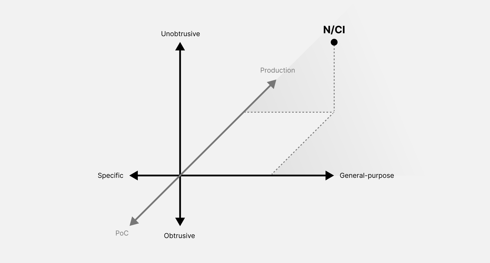

# Spatial Place

Spatial Place is the project title of my bachelor thesis, in which I researched and explored the mass-market applicability of a novel software system for bringing brain-computer interface software to the cloud. I called the product of this new interdisciplinary field between brain-computer interface software and cloud computing a **neural/cloud interface**.

## Description

My bachelor thesis was completed in collaboration with [IDUN Technologies](https://iduntechnologies.com) and their proprietary [DRYODE™ Guardian](https://iduntechnologies.com/guardian-dev-kit) product, an electroencephalography (EEG) sensor that resembles a standard in-ear headphone. Since the start of my undergraduate project, I've been working for IDUN as a cloud software engineer, revising the Guardian software products to make them more user-friendly, functional, and especially cloud-ready. IDUN aims to create a cloud platform with a scalable and robust architecture for deploying and managing neural signal processing pipelines. This includes an public SDK and API for interacting with the Guardian hardware as well as a cloud infrastructure, microservice cluster and internal SDK as described in the thesis.

Because the source code of the mentioned software components is proprietary and hence subject to a copyrighted license, I cannot put it in a public repository. I have included a copy of the associated repositories, so that the examiners may see the source code and understand how the neural/cloud interface works in implementation when evaluating my project.

## Other Artefacts

- All figures that I created on my own can be found under this [URL](https://www.figma.com/file/lSKhgYwDk9KIQbGooflm4X/figures?node-id=0%3A1).
- You can find the whiteboard in Figma via this [URL](https://www.figma.com/file/bYgmQkS6tlizeVgHK3YWT1/whiteboard?node-id=0%3A1). It includes ideas, old drafts, and notes from the project.
